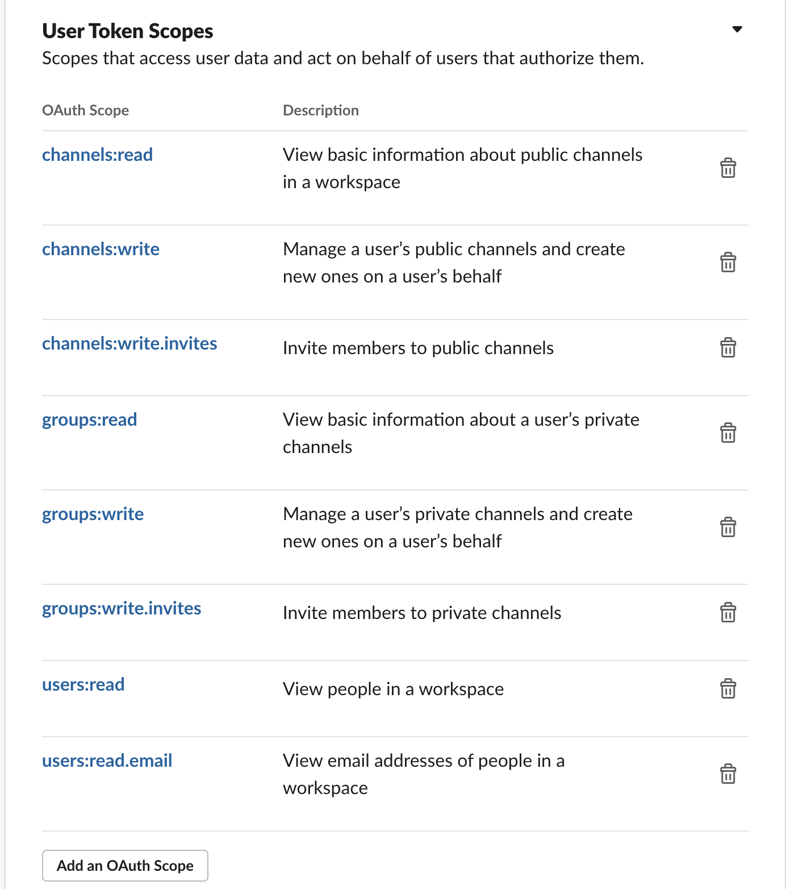
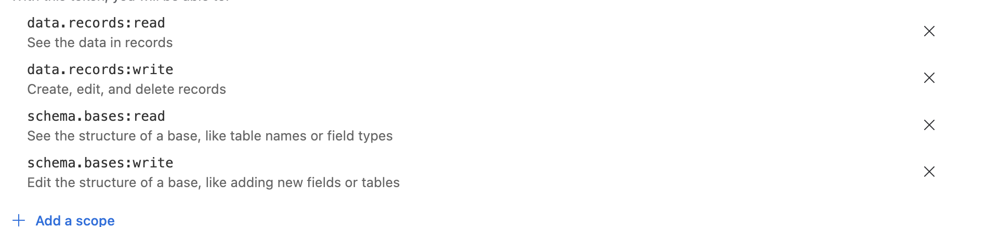
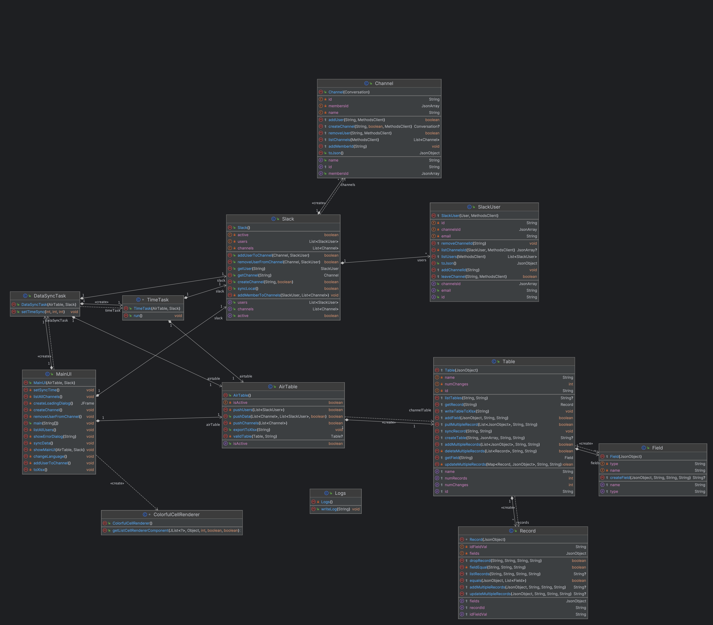

# Project1 
## Slack Controller with Airtable Sync

#### Written by: [Phan Phan Hải Long](https://www.facebook.com/hailong.phanphan/) and [Nguyễn Hải Ninh](https://www.facebook.com/ninh.hai.39589149)

###### Note: This project written and tested on Java SDK 20.0.1, so it is recommended to use the same version to avoid any issues.


### 1.Reload pom.xml file to download all dependencies and plugins needed for the project.

### 2.Fill `Slack token`, `Airtable token` and `Airtable base id` in [config.json](src%2Fmain%2Fresources%2Fdata%2Fconfig.json) file: 

##### &nbsp;&nbsp;&nbsp;&nbsp;&nbsp;&nbsp; - Please get `Slack User token` with below permissions to be able to use all features of the application:

[//]: # (link to slackScopes.png)


##### &nbsp;&nbsp;&nbsp;&nbsp;&nbsp;&nbsp; - Please get `Airtable token` with below permissions to be able to use all features of the application:

[//]: # (link to airtableScopes.png)


##### &nbsp;&nbsp;&nbsp;&nbsp;&nbsp;&nbsp; - Please get `Airtable base id` from your airtable base and make sure that Table and Field has name in [fields](src%2Fmain%2Fresources%2Fdata%2Ffields.json) will match with [fields](src%2Fmain%2Fresources%2Fdata%2Ffields.json), otherwise you will get an error. You can refill your base configuration in [fields](src%2Fmain%2Fresources%2Fdata%2Ffields.json), or you drop all tables and fields not match with [fields](src%2Fmain%2Fresources%2Fdata%2Ffields.json) file and this application will create them  exactly as in [fields](src%2Fmain%2Fresources%2Fdata%2Ffields.json) automatically.

[//]: # (link to airtableBaseId.png)
### 3.To start the application, run main method in class [MainUI](src%2Fmain%2Fjava%2Fmain%2FMainUI.java).


#### List of dependencies used in the project:

```xml
    <dependencies>
    
        <!-- use for parsing json files-->
        <dependency>
            <groupId>com.google.code.gson</groupId>
            <artifactId>gson</artifactId>
            <version>2.10.1</version>
        </dependency>


        <!--  use for make http requests to airtable api -->
        <dependency>
            <groupId>org.apache.httpcomponents.client5</groupId>
            <artifactId>httpclient5</artifactId>
            <version>5.2.1</version>
        </dependency>

        <!-- use for make requests to slack api -->
        <dependency>
            <groupId>com.slack.api</groupId>
            <artifactId>slack-api-client</artifactId>
            <version>1.29.2</version>
        </dependency>

        <!-- use for make xlsx files -->
        <dependency>
            <groupId>org.apache.poi</groupId>
            <artifactId>poi-ooxml</artifactId>
            <version>5.2.3</version>
        </dependency>
    
    </dependencies>


```

### The below is the project class diagram:

[//]: # (link to classDiagram.png)

